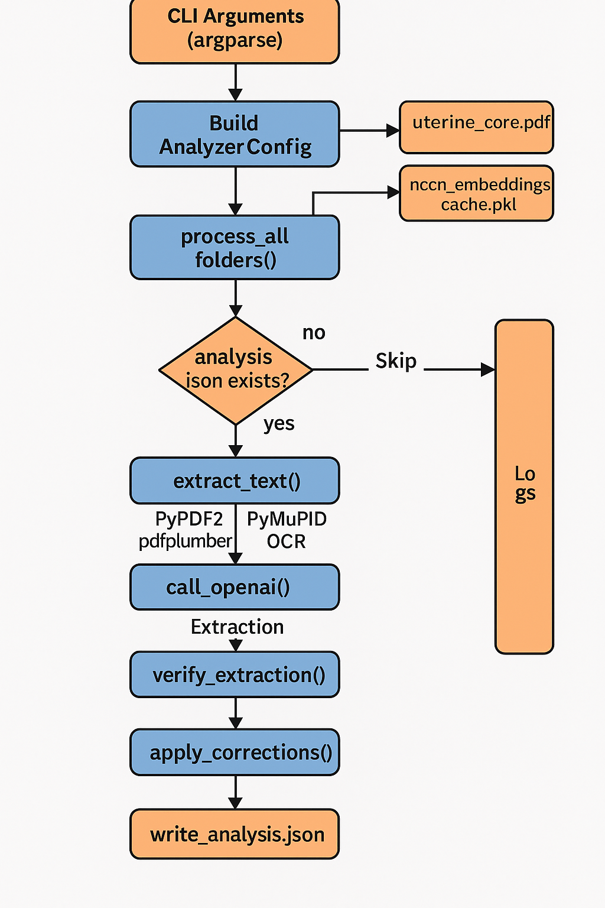

# Pathology Analyzer


A sophisticated medical document processing system that extracts and verifies structured information from pathology reports using large language models and medical guidelines.

## Overview

Pathology Analyzer is an advanced tool designed to analyze pathology reports, especially in oncology. It extracts critical medical information from PDF documents and verifies it against the National Comprehensive Cancer Network (NCCN) guidelines.

The system employs a multi-stage approach:
1. **Text extraction** from PDF documents using multiple fallback methods
2. **Semantic search** to find relevant NCCN guidelines for each report
3. **Information extraction** using Large Language Models (LLMs)
4. **Verification and correction** of extracted information through a separate verification agent

This comprehensive approach ensures high accuracy and reliability while providing both professional medical summaries and patient-friendly explanations.

## Features

- **Robust PDF text extraction** with fallback mechanisms (PyMuPDF, pdfplumber, PyPDF2, OCR)
- **Semantic search** using embeddings to find relevant medical guidelines
- **Comprehensive information extraction** including:
  - Cancer organ type and subtype
  - FIGO staging
  - Pathologic staging (including TNM)
  - Treatment recommendations based on NCCN guidelines
  - Professional medical description
  - Patient-friendly notes
- **Two-stage verification system** with automatic correction
- **Field-specific confidence scores** for verification results
- **Efficient processing** with caching for embeddings and semantic search
- **Batch processing** of multiple reports
- **Detailed logging** for tracking and debugging

## Installation

### Prerequisites

- Python 3.9+
- Tesseract OCR (for OCR fallback)

### Setup

1. Clone the repository:
   ```bash
   git clone https://github.com/yourusername/pathology-analyzer.git
   cd pathology-analyzer
   ```

2. Install dependencies:
   ```bash
   pip install -r requirements.txt
   ```

3. Set up your OpenAI API key:
   ```bash
   export OPENAI_API_KEY="your-api-key"
   ```

4. Place the NCCN guidelines PDF in the project root (default: `uterine_core.pdf`)

## Usage

### Basic Usage

Run the analyzer on a directory of case folders:

```bash
python pathology-analyzer.py
```

Each case folder should contain a PDF pathology report. The analyzer will create an `analysis.json` file in each folder with the extracted information.

### Command-line Options

```bash
python pathology-analyzer.py --help
```

Options include:
- `--rebuild-cache`: Force regeneration of embeddings cache
- `--no-verify`: Disable verification step
- `--detailed-verify`: Enable detailed field-by-field verification
- `--root-dir PATH`: Specify root directory for case folders
- `--nccn-pdf PATH`: Specify path to NCCN guidelines PDF
- `--api-key KEY`: Provide OpenAI API key
- `--model MODEL`: Specify OpenAI model to use

### Output Format

The analyzer produces a JSON file with the following structure:

```json
{
  "cancer_organ_type": "Uterine cancer",
  "cancer_subtype": "Endometrioid adenocarcinoma",
  "figo_stage": "FIGO Stage IA",
  "pathologic_stage": "pT1a pN0 M0",
  "recommended_treatment": "Simple hysterectomy with bilateral salpingo-oophorectomy...",
  "description": "Pathology report indicates well-differentiated endometrioid adenocarcinoma...",
  "patient_notes": "Your pathology report shows an early-stage uterine cancer...",
  "verification": {
    "passed": true,
    "confidence": 0.95,
    "assessment": "Extraction verified successfully",
    "field_issues": { ... },
    "incorrect_fields": [ ... ],
    "timestamp": "2025-05-11T15:23:42.123456"
  }
}
```

## Architecture

The system architecture consists of several key components:

1. **PDF Processing Module**: Extracts text from pathology reports using multiple methods with automatic fallback.

2. **Embedding and Retrieval System**: Creates vector representations of text and performs semantic search to find relevant guidelines.

3. **OpenAI API Interaction**: Handles communication with OpenAI models for text processing and analysis.

4. **Verification Agent**: Provides independent verification of extracted information and suggests corrections.

5. **Main Processing Pipeline**: Coordinates the entire workflow from PDF processing to result storage.



## Technologies Used

- **PDF Processing**: PyMuPDF (fitz), pdfplumber, PyPDF2
- **OCR**: Tesseract (via pytesseract)
- **Machine Learning**: OpenAI API, Vector Embeddings
- **Data Processing**: NumPy, tiktoken
- **Image Processing**: PIL (Python Imaging Library)
- **Utilities**: tqdm (progress bars), tenacity (retry logic)

## Project Structure

```
pathology-analyzer/
├── pathology-analyzer.py    # Main application
├── requirements.txt         # Dependencies
├── logs/                    # Log files
├── cases/                   # Case folders containing PDFs
├── uterine_core.pdf         # NCCN guidelines
└── nccn_embeddings_cache.pkl # Cached embeddings
```

## Contributing

Contributions are welcome! Please feel free to submit a Pull Request.

1. Fork the repository
2. Create your feature branch (`git checkout -b feature/amazing-feature`)
3. Commit your changes (`git commit -m 'Add some amazing feature'`)
4. Push to the branch (`git push origin feature/amazing-feature`)
5. Open a Pull Request

## License

This project is licensed under the MIT License - see below for details:

```
MIT License

Copyright (c) 2025 Your Name

Permission is hereby granted, free of charge, to any person obtaining a copy
of this software and associated documentation files (the "Software"), to deal
in the Software without restriction, including without limitation the rights
to use, copy, modify, merge, publish, distribute, sublicense, and/or sell
copies of the Software, and to permit persons to whom the Software is
furnished to do so, subject to the following conditions:

The above copyright notice and this permission notice shall be included in all
copies or substantial portions of the Software.

THE SOFTWARE IS PROVIDED "AS IS", WITHOUT WARRANTY OF ANY KIND, EXPRESS OR
IMPLIED, INCLUDING BUT NOT LIMITED TO THE WARRANTIES OF MERCHANTABILITY,
FITNESS FOR A PARTICULAR PURPOSE AND NONINFRINGEMENT. IN NO EVENT SHALL THE
AUTHORS OR COPYRIGHT HOLDERS BE LIABLE FOR ANY CLAIM, DAMAGES OR OTHER
LIABILITY, WHETHER IN AN ACTION OF CONTRACT, TORT OR OTHERWISE, ARISING FROM,
OUT OF OR IN CONNECTION WITH THE SOFTWARE OR THE USE OR OTHER DEALINGS IN THE
SOFTWARE.
```

## Performance Considerations

- **Memory Usage**: Processing large PDF files and embedding models requires substantial RAM.
- **API Costs**: The system makes multiple calls to OpenAI API, which has usage costs.
- **Cache Management**: The embedding cache grows with the number of processed guidelines.
- **OCR Performance**: The OCR fallback is significantly slower but provides reliability for scanned documents.

## References

- [NCCN Guidelines](https://www.nccn.org/guidelines/category_1)
- [OpenAI API Documentation](https://platform.openai.com/docs/api-reference)
- [FIGO Staging for Uterine Cancer](https://www.cancer.org/cancer/types/endometrial-cancer/detection-diagnosis-staging/staging.html)

## Contact

For questions or support, please open an issue on this repository or contact [your-email@example.com](mailto:your-email@example.com).